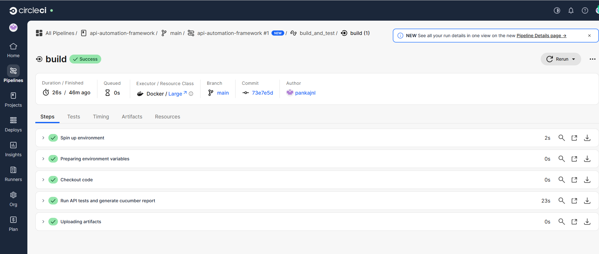
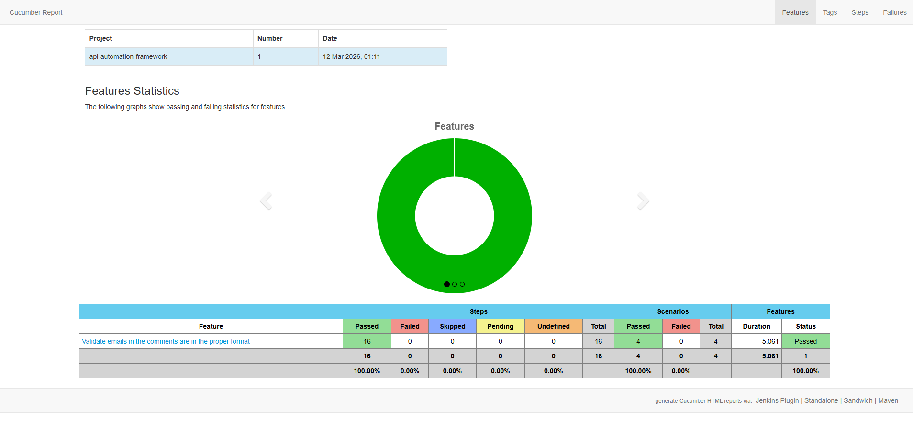

# API Automation Framework

This repository contains an API automation framework developed using Rest Assured for API testing.

The framework validates a workflow for the JSONPlaceholder blog APIs.

## Tech Stack

- Java
- Maven
- Rest Assured
- Cucumber (BDD)
- TestNG
- Jackson (POJO mapping)
- PicoContainer
- CircleCI

## Non Automated Test Scenarios

The following scenarios were identified as part of test coverage analysis but were not automated in the current scope:

- Retrieve comments when valid postId is provided
- Comments should belongs to the post when valid postId is provided
- Comments should contain valid comment ids when valid postId is provided
- No comments should be returned when post has no comments
- Emails in comments should be in valid format when valid postId is provided
- Comment email should not be empty when valid postId is provided
- No comments should be returned when invalid postId is provided
- No comments should be returned when postId is non numeric
- No comments should be returned when postId is empty
- Retrieve posts details when valid userId is provided
- Posts should belongs to the user when valid userId is provided
- No posts should be returned when user has no posts
- Posts should contain valid post ids when valid userId is provided
- No posts should be returned when invalid userId is provided
- No post should be returned when userId is non numeric
- No post should be returned when userId is empty
- Retrieve user details when valid username is provided
- User details retrieval should be case insensitive
- Only one user should be returned when valid username is provided
- User email should be in valid format when valid username is provided
- User details should contain valid id when valid username is provided
- User does not exist when invalid username is provided
- User does not exist when empty username is provided
- User does not exist when only special characters are provided as username

These scenarios were documented to demonstrate test design thinking and broader workflow coverage.

## Project Structure

```text
src
 ├── main
 │   └── java
 │       └── pojo
 │           ├── Address.java
 │           ├── Comments.java
 │           ├── Company.java
 │           ├── Geo.java
 │           ├── Posts.java
 │           └── User.java
 │
 └── test
     ├── java
     │   ├── context
     │   │   └── TestContext.java
     │   ├── cucumber.options
     │   │   └── TestRunner.java
     │   ├── helpers
     │   │   ├── APIResources.java
     │   │   ├── Utils.java
     │   │   └── Validator.java
     │   └── stepdefinitions
     │       ├── CommentsEmailValidationSteps.java
     │       └── Hooks.java
     │
     └── resources
         ├── config
         │   └── global.properties
         └── features
             └── emails_in_comments_validation.feature
```     
## Framework Design Highlights
- POJO-based response deserialization for clean object mapping
- Reusable request specification through utility methods
- API endpoints centralized using enum
- Cucumber BDD scenarios for readability
- Shared test context with PicoContainer
- Logging enabled for easier debugging
- Tag-based execution support for flexible suite selection
- CI execution with CircleCI
- Cucumber HTML report generation through Maven

## How to Run the Tests
### Prerequisites
Make sure the following are installed:
- Java 17
- Maven
### Run tests from terminal
To execute the email validation suite:
```bash
mvn clean verify -Dcucumber.filter.tags="@email_validation"
```

## Test Reports
After execution, the Cucumber HTML report is generated under:
```text
target/cucumber-html-reports
```

## Logging
Logs are written to: 
```text
logging.txt
```

The log file is overwritten for each run so that only the current execution logs are preserved.

## API Under Test
The framework uses the public JSONPlaceholder API:
https://jsonplaceholder.typicode.com

## CI Integration
The framework is integrated with CircleCI.

Tests are executed in CI using:
```bash
mvn clean verify -Dcucumber.filter.tags="@email_validation"
```

After successful execution, the generated Cucumber reports are uploaded as CircleCI artifacts.

## CI Execution Result

CircleCI pipeline successfully executes the test suite and generates reports.
### CircleCI Pipeline


### Cucumber Report

## Author
Pankaj Nalawade